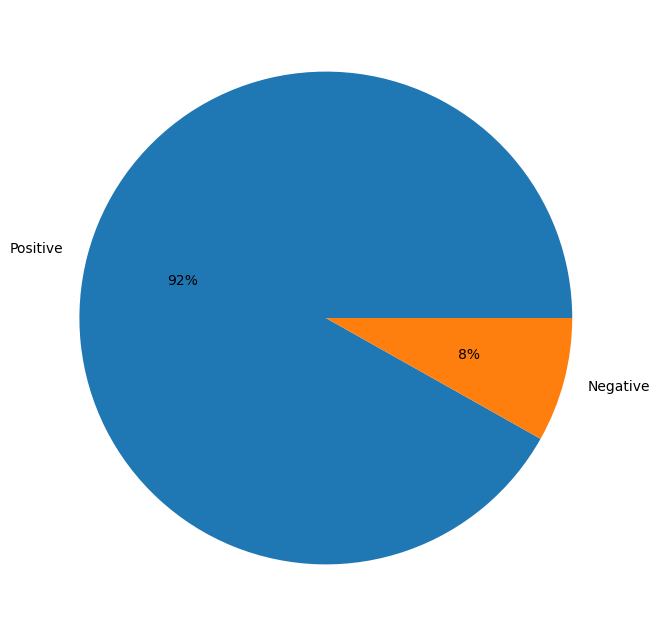
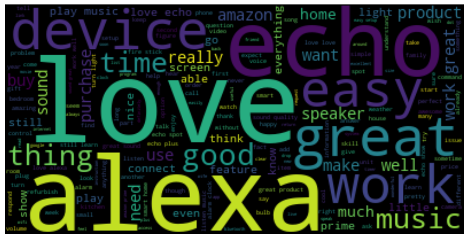
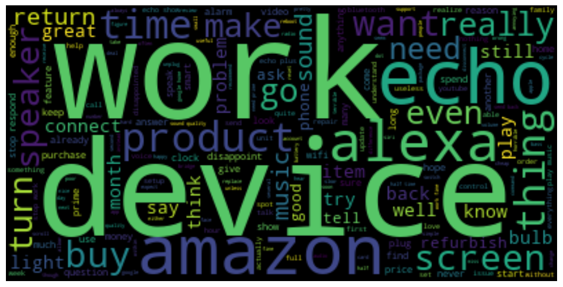
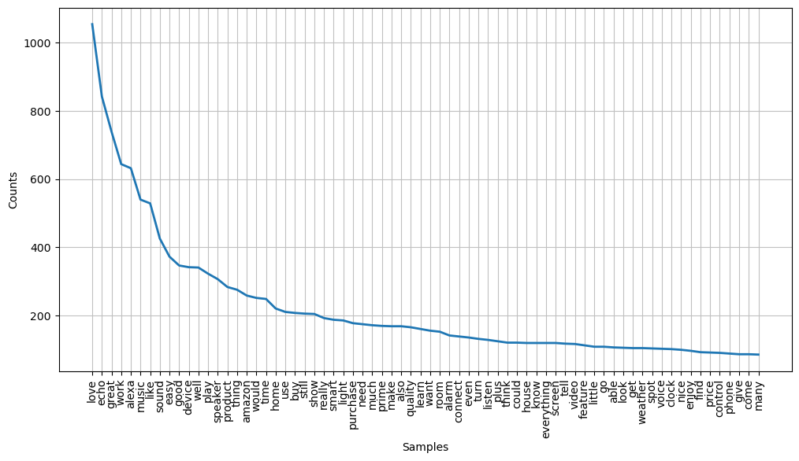
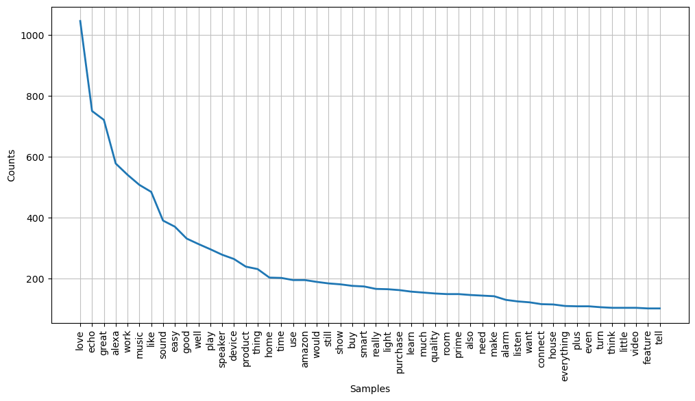
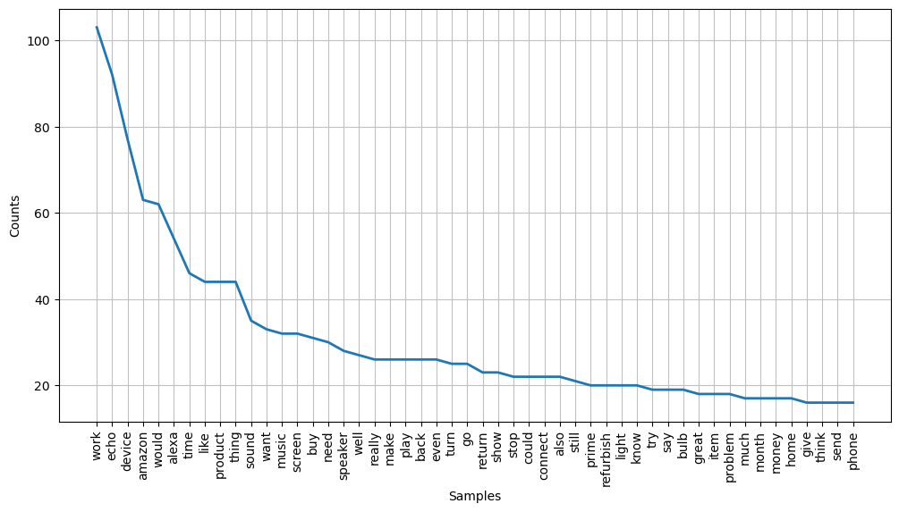

# Customers-Feedback-Analysis

The project involves conducting customer feedback analysis for Amazon Alexa. The goal is to analyze and understand customer sentiments expressed in their reviews or feedback about the Amazon Alexa product or service. The project utilizes various machine learning and natural language processing techniques to accomplish this task.

### Necessary Packages
```js
# Import Packages

import pandas as pd

pd.set_option('display.max_rows', None)
pd.set_option('display.max_columns', None)

import numpy as np
import matplotlib.pyplot as plt
import seaborn as sns

import re

import spacy
import string
import nltk
from nltk import word_tokenize
from nltk.corpus import stopwords
from nltk.stem import PorterStemmer
from nltk.stem import WordNetLemmatizer

# nltk.download('stopwords')
# nltk.download('punkt')

nlp = spacy.load("en_core_web_sm")
punct = string.punctuation
stem = PorterStemmer()
lemma = WordNetLemmatizer()

from wordcloud import WordCloud
from nltk.probability import FreqDist

from sklearn.feature_extraction.text import CountVectorizer
from sklearn.feature_extraction.text import TfidfVectorizer
from sklearn.preprocessing import normalize

from sklearn.model_selection import train_test_split

from sklearn.linear_model import LogisticRegression
from sklearn.naive_bayes import BernoulliNB
from sklearn.naive_bayes import GaussianNB
from sklearn.naive_bayes import MultinomialNB
from sklearn.svm import SVC
from sklearn.tree import DecisionTreeClassifier
from sklearn.ensemble import RandomForestClassifier

from sklearn.metrics import accuracy_score

from sklearn.model_selection import cross_val_score
from sklearn.model_selection import GridSearchCV

'''
import tensorflow as tf
from tensorflow.keras.preprocessing.text import Tokenizer
from tensorflow.keras.preprocessing.sequence import pad_sequences
from tensorflow.keras.models import Sequential
from tensorflow.keras.layers import Embedding, Conv1D, GlobalMaxPooling1D, Flatten, Dense, LSTM
'''

import warnings
warnings.filterwarnings('ignore')
```

### Reading Data
```js
root = pd.read_csv(r'amazon_alexa.tsv' , delimiter = '\t' , quoting = 3)
data = root.copy()

```
### Splitting data

```js
# Ind and Dep variable


data = data.drop(['rating','date','variation'],axis = 1)
data.columns = ['reviews' , 'target']

x = data['reviews']
y = data['target']
```
```js
print(x.head(10))
```
```
0                                        Love my Echo!
1                                            Loved it!
2    "Sometimes while playing a game, you can answe...
3    "I have had a lot of fun with this thing. My 4...
4                                                Music
5    "I received the echo as a gift. I needed anoth...
6    "Without having a cellphone, I cannot use many...
7    I think this is the 5th one I've purchased. I'...
8                                          looks great
9    "Love it! I’ve listened to songs I haven’t hea...
```
## Pata Preprocessing
To begin with, the project incorporates NLP (Natural Language Processing), Spacy, Regular Expression techniques to preprocess and clean the textual data obtained from customer feedback. This step involves tasks like tokenization, removing stopwords, stemming, and lemmatization.
### Replacing Common Contractions
```js
# replace_text
def replace_text(rev):
    
    reviews = re.sub(r"what's", "what is ", rev)
    reviews = re.sub(r"\'s", " is", reviews)
    reviews = re.sub(r"\'ve", " have ", reviews)
    reviews = re.sub(r"can't", "cannot ", reviews)
    reviews = re.sub(r"n't", " not ", reviews)
    reviews = re.sub(r"i'm", "i am ", reviews)
    reviews = re.sub(r"\'re", " are ", reviews)
    reviews = re.sub(r"\'d", " would ", reviews)
    reviews = re.sub(r"\'ll", " will ", reviews)
    reviews = re.sub(r"\'scuse", " excuse ", reviews)
    reviews = re.sub('\W', ' ', reviews)
    reviews = re.sub('\s+', ' ', reviews)
    reviews = reviews.strip(' ')
    
    return reviews

for i in range(len(x)) :
    x[i] = replace_text(x[i])
```
```js
print(x.head(10))
```
```
0                                         Love my Echo
1                                             Loved it
2    Sometimes while playing a game you can answer ...
3    I have had a lot of fun with this thing My 4 y...
4                                                Music
5    I received the echo as a gift I needed another...
6    Without having a cellphone I cannot use many o...
7    I think this is the 5th one I have purchased I...
8                                          looks great
9    Love it I ve listened to songs I haven t heard...
```
### Replacing Non-alphabetic Characters
```js
# cleaned_text
def cleaned_text(rev):
      
    reviews = re.sub(r'\[[0-9]*\]', ' ',rev)
    reviews = re.sub(r'\s+', ' ', reviews)
    reviews = re.sub('[^a-zA-Z]', ' ', reviews )
    reviews = re.sub(r'\s+', ' ', reviews)
    reviews = re.sub(r'\W*\b\w{1,3}\b', "",reviews)
    reviews = reviews.strip()
    
  
    return reviews


for i in range(len(x)) :
    x[i] = cleaned_text(x[i])
```
```js
print(x.head(10))
```
```
0                                            Love Echo
1                                                Loved
2    Sometimes while playing game answer question c...
3    have with this thing learns about dinosaurs co...
4                                                Music
5    received echo gift needed another Bluetooth so...
6    Without having cellphone cannot many features ...
7    think this have purchased working getting ever...
8                                          looks great
9    Love listened songs haven heard since childhoo...
```

### Remove Stopwords
```js
# remove_stopwords
def remove_stopwords(rev):
    
    stop_words = set(stopwords.words('english'))
    
    tokens = word_tokenize(rev)
    tokens = [token.lower() for token in tokens]
    tokens = [token for token in tokens if token not in stop_words]
    reviews = ' '.join(tokens)
    
    return reviews

for i in range(len(x)) :
    x[i] = remove_stopwords(x[i])
```

### lemmatize  
```js
def lemmatize(rev):
    
    doc = nlp(rev)
    reviews = [words.lemma_ for words in doc]
    reviews = ' '.join(reviews)
    
    return reviews


for i in range(len(x)) :
    x[i] = lemmatize(x[i])
```
```js
print(x.head(10))
```
```
0                                            love echo
1                                                 love
2    sometimes play game answer question correctly ...
3    thing learn dinosaur control light play game l...
4                                                music
5    receive echo gift need another bluetooth somet...
6    without cellphone many feature ipad great alar...
7    think purchase work get every room house reall...
8                                           look great
9    love listen song hear since childhood news wea...
```


#### new data_frame for ann cnn and rnn
```js
new_data = data.copy()

file_path = r'C:\Users\asbpi\Desktop\Nit_DS & AI\MY Projects\project_sentiment analysis\new_data.csv'
new_data.to_csv(file_path, index=False)
```

### Viewing Positive and Negative reviews
```js
all_reviews = data['reviews']
pos_reviews = data['reviews'][data['target'] == 1]
neg_reviews = data['reviews'][data['target'] == 0]
```
```js
all_reviews = ' '.join(all_reviews .tolist())
pos_reviews = ' '.join(pos_reviews .tolist())
neg_reviews = ' '.join(neg_reviews .tolist())
```
#### Pie plot to check the percentages of positive and negative reviews
```js
plt.pie(data['target'].value_counts() , labels=['Positive','Negative'] , autopct='%1.0f%%')
plt.show()
```


### WordCloud

#### All Reviews
```js
all_wordcloud = WordCloud(random_state=42 , max_font_size=100).generate(all_reviews)
plt.figure(figsize=(12,8))
plt.imshow(all_wordcloud, interpolation='bilinear')
plt.axis('off')
plt.show()
```


#### Posotive Reviews
```js
pos_wordcloud = WordCloud(random_state=42 , max_font_size=100).generate(pos_reviews)
plt.figure(figsize=(12,8))
plt.imshow(pos_wordcloud, interpolation='bilinear')
plt.axis('off')
plt.show()
```


#### Negative Reviews
```js
neg_wordcloud = WordCloud(random_state=42 , max_font_size=100).generate(neg_reviews)
plt.figure(figsize=(12,8))
plt.imshow(neg_wordcloud, interpolation='bilinear')
plt.axis('off')
plt.show()
```


### Frequency Distribution Plot 
##### Frequency distribution plot to check the frequencies of each words in all reviews
```js
fredi=nltk.word_tokenize(all_reviews)
freqDist = FreqDist(fredi)
plt.figure(figsize=(12,6))
plt.xticks([])
freqDist.plot(70)
plt.show()
```


##### Frequency distribution plot to check the frequencies of each words in positive reviews
```js
fredi=nltk.word_tokenize(pos_reviews)
freqDist = FreqDist(fredi)
plt.figure(figsize=(12,6))
plt.xticks([])
freqDist.plot(50)
plt.show()
```


##### Frequency distribution plot to check the frequencies of each words in negative reviews
```js
fredi=nltk.word_tokenize(neg_reviews)
freqDist = FreqDist(fredi)
plt.figure(figsize=(12,6))
plt.xticks([])
freqDist.plot(50)
plt.show()
```


### vectorization

#### CountVectorizer
```js
vectorizer = CountVectorizer().fit(x)
feature_names = vectorizer.get_feature_names_out()
X = vectorizer.transform(x).toarray()

X_c = pd.DataFrame(X , columns= feature_names)
```
#### TfidfVectorizer
```js
vectorizer = TfidfVectorizer().fit(x)
feature_names = vectorizer.get_feature_names_out()
X = vectorizer.transform(x).toarray()

X_t = pd.DataFrame(X , columns= feature_names)
```

### spliting

#### Splitting data into Train and Test sets
80 percentages of data for training and 20 percentages of data for Testing.
```js
X_train, X_test, y_train, y_test = train_test_split(X_t, y, test_size = 0.20, random_state = 0)
```

## Model Fitting
The project leverages a variety of supervised learning algorithms, including logistic regression (logit), support vector machines (SVM), naive Bayes, decision trees, and random forests, to train models using annotated customer feedback data.

### LogisticRegression
```js
# Logit
logit = LogisticRegression()
logit.fit(X_train, y_train)

y_pred = logit.predict(X_test)
```
```js
# Calculate accuracy
accuracy = accuracy_score(y_test, y_pred)
print("Accuracy:", accuracy)
```
Accuracy: 0.9174603174603174

### Naive Byas
#### 1. BernoulliNB
```js
# Train the Bernoulli Naive Bayes classifier
berNB = BernoulliNB()
berNB.fit(X_train, y_train)
# Predict on the test set
y_pred = berNB.predict(X_test)
```
```js
# Calculate accuracy
accuracy = accuracy_score(y_test, y_pred)
print("Accuracy:", accuracy)
```
Accuracy: 0.9047619047619048

#### 2. GaussianNB
```js
# Train the Gaussian Naive Bayes classifier
gauNB = GaussianNB()
gauNB.fit(X_train, y_train)

# Predict on the test set
y_pred = gauNB.predict(X_test)
```
```js
# Calculate accuracy
accuracy = accuracy_score(y_test, y_pred)
print("Accuracy:", accuracy)
```
Accuracy: 0.5523809523809524

#### 3. MultinomialNB
```js
# Train the Multinomial Naive Bayes classifier
mulNB = MultinomialNB()
mulNB.fit(X_train, y_train)

# Predict on the test set
y_pred = mulNB.predict(X_test)
```
```js
# Calculate accuracy
accuracy = accuracy_score(y_test, y_pred)
print("Accuracy:", accuracy)
```
Accuracy: 0.9158730158730158
### Support Vector Machine (SVM)
```js
# Train the SVM classifier
svm = SVC()
svm.fit(X_train, y_train)

# Predict on the test set
y_pred = svm.predict(X_test)
```
```js
# Calculate accuracy
accuracy = accuracy_score(y_test, y_pred)
print("Accuracy:", accuracy)
```
Accuracy: 0.926984126984127

### Decession Tree
```js
# Train the DecisionTreeClassifier
dectree = DecisionTreeClassifier()
dectree.fit(X_train, y_train)

# Predict on the test set
y_pred = dectree.predict(X_test)
```
```js
# Calculate accuracy
accuracy = accuracy_score(y_test, y_pred)
print("Accuracy:", accuracy)
```
Accuracy: 0.9317460317460318

### Random Forest
```js
# Train the RandomForestClassifier
randForest = RandomForestClassifier()
randForest.fit(X_train, y_train)

# Predict on the test set
y_pred = randForest.predict(X_test)
```
```js
# Calculate accuracy
accuracy = accuracy_score(y_test, y_pred)
print("Accuracy:", accuracy)
```
Accuracy: 0.9380952380952381


### Cross Validation

#### K fold
```js
randForest = RandomForestClassifier()

# Perform cross-validation
scores = cross_val_score(randForest, X_train, y_train, cv=10)

print("Cross-validation scores:", scores)
```
Cross-validation scores: [0.94444444 0.93253968 0.93253968 0.94444444 0.94047619 0.94444444
 0.93650794 0.92857143 0.92857143 0.93253968]

```js
# Calculate the mean accuracy across all folds
mean_accuracy = scores.mean()
print("Mean Accuracy:", mean_accuracy)
```
Mean Accuracy: 0.9365079365079364

#### Grid Search
```js
randForest = RandomForestClassifier()

# Define the parameter grid
param_grid = {
    'n_estimators': [100, 200, 300],
    'max_depth': [None, 5, 10],
    'min_samples_split': [2, 5, 10]
}

# Perform grid search with cross-validation
grid_search = GridSearchCV(estimator=randForest, param_grid=param_grid, cv=5)
grid_search.fit(X_train, y_train)
```
```js
# Print the best parameters and best score
print("Best Parameters:", grid_search.best_params_)
```

```js
print("Best Score:", grid_search.best_score_)
```


